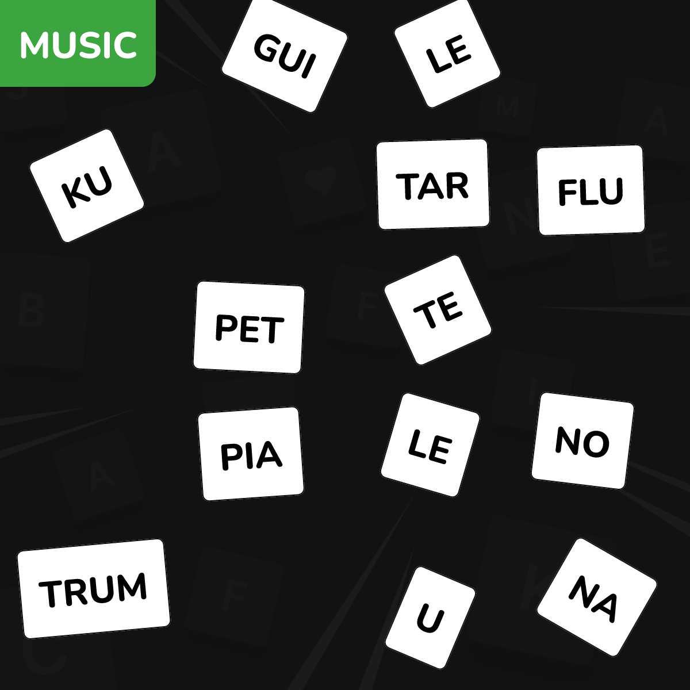
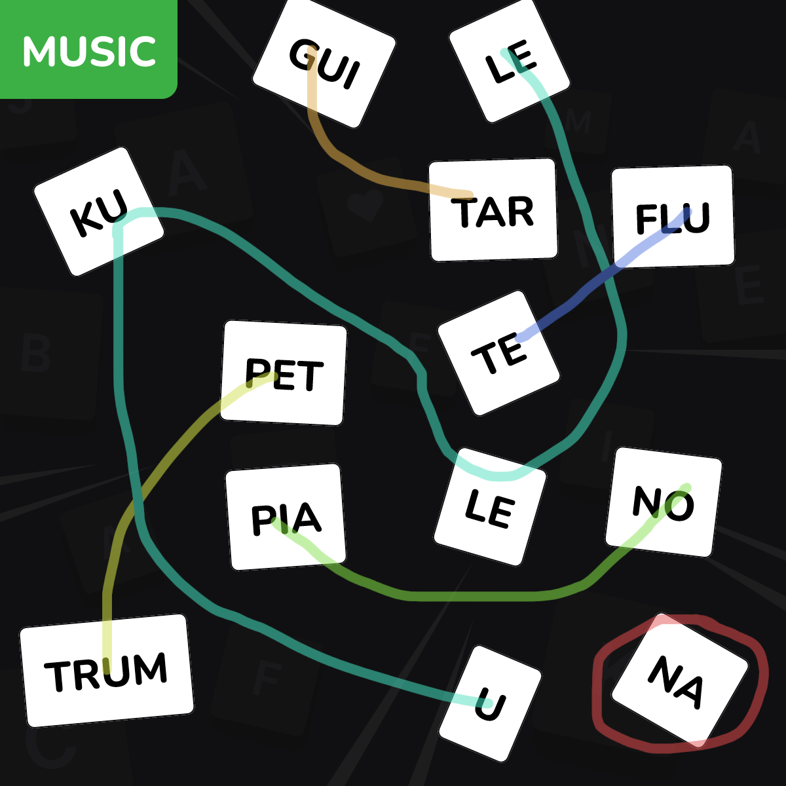

# 🗃️ Syllable Game

> Playful way to learn word spelling.

## 👀 Demo

Application deployed publically on Vercel: X

## 🧰 Tech Stack

- [Next.js](https://nextjs.org/)
- [Satori (Vercel OG)](https://github.com/vercel/satori)

## 📚 Documentation

Use endpoint `/api/game` to generate a game screen. Use URL parameters to configure it:

- `topic` - title of the screen
- `words` - Words to use in the game
- `extra` - Secret that should be result of game

A few examples:

- `/api/game?words=yellow,indigo,purple,orange&topic=Music&extra=an`
- `/api/game?words=piano,guitar,ukulele,trumpet,flute&topic=Music&extra=na`

## 👀 Setup Client

1. Install libarries `npm install`
3. Start server `npm serve`

## 🚀 Deploy client

1. Build with `npm build`
2. Deploy from `.next`

> If deploying to static hosting, use `npm run generate` instead, and deploy files from `out` folder.

## 🤝 Contributing

No contribution guidelines yet, it's too small of a project.

## 🖼️ Screenshots




## 🤖 Auto-generated documentation

This is a [Next.js](https://nextjs.org/) project bootstrapped with [`create-next-app`](https://github.com/vercel/next.js/tree/canary/packages/create-next-app).

## Getting Started

First, run the development server:

```bash
npm run dev
# or
yarn dev
```

Open [http://localhost:3000](http://localhost:3000) with your browser to see the result.

You can start editing the page by modifying `pages/index.js`. The page auto-updates as you edit the file.

[API routes](https://nextjs.org/docs/api-routes/introduction) can be accessed on [http://localhost:3000/api/hello](http://localhost:3000/api/hello). This endpoint can be edited in `pages/api/hello.js`.

The `pages/api` directory is mapped to `/api/*`. Files in this directory are treated as [API routes](https://nextjs.org/docs/api-routes/introduction) instead of React pages.

## Learn More

To learn more about Next.js, take a look at the following resources:

- [Next.js Documentation](https://nextjs.org/docs) - learn about Next.js features and API.
- [Learn Next.js](https://nextjs.org/learn) - an interactive Next.js tutorial.

You can check out [the Next.js GitHub repository](https://github.com/vercel/next.js/) - your feedback and contributions are welcome!

## Deploy on Vercel

The easiest way to deploy your Next.js app is to use the [Vercel Platform](https://vercel.com/new?utm_medium=default-template&filter=next.js&utm_source=create-next-app&utm_campaign=create-next-app-readme) from the creators of Next.js.

Check out our [Next.js deployment documentation](https://nextjs.org/docs/deployment) for more details.
